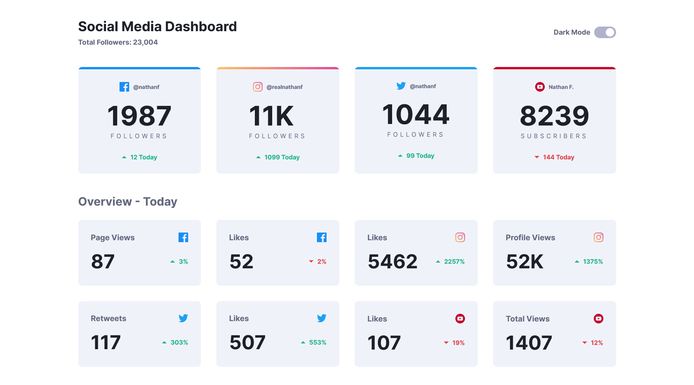

# Frontend Mentor - Social media dashboard with theme switcher solution

This is a solution to the [Social media dashboard with theme switcher challenge on Frontend Mentor](https://www.frontendmentor.io/challenges/social-media-dashboard-with-theme-switcher-6oY8ozp_H). Frontend Mentor challenges help you improve your coding skills by building realistic projects.

## Table of contents

- [Overview](#overview)
  - [Screenshot](#screenshot)
  - [Links](#links)
- [My process](#my-process)
  - [Built with](#built-with)
- [Author](#author)

## Overview

### Screenshot

### Links

- Live Site URL: [https://amazing-tartufo-5c3bd7.netlify.app/](https://amazing-tartufo-5c3bd7.netlify.app/)

## My process

### Built with

- Semantic HTML5 markup
- CSS custom properties
- Preprocessor SCSS
- JavaScript
- React

## Author

- Frontend Mentor - [@StinkyCodeMACHINE](https://www.frontendmentor.io/profile/StinkyCodeMACHINE)
